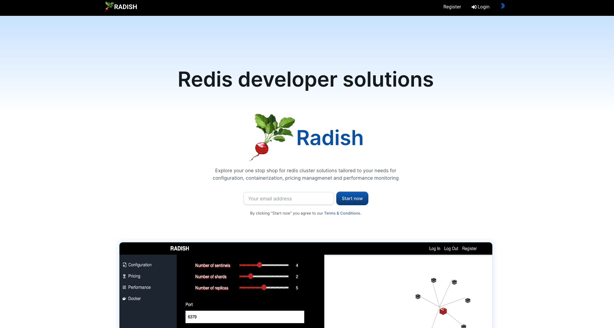
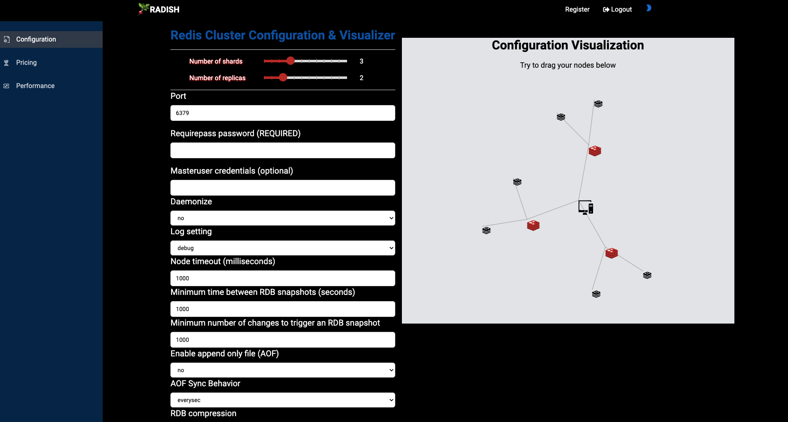
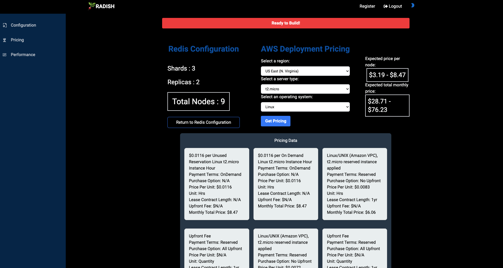
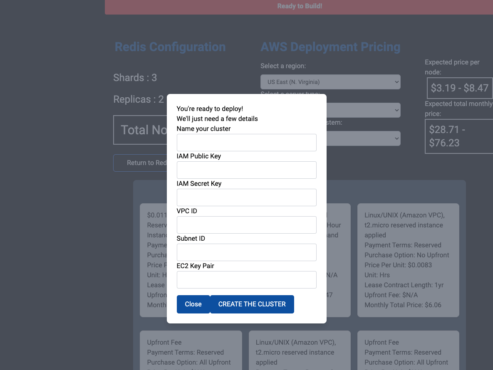
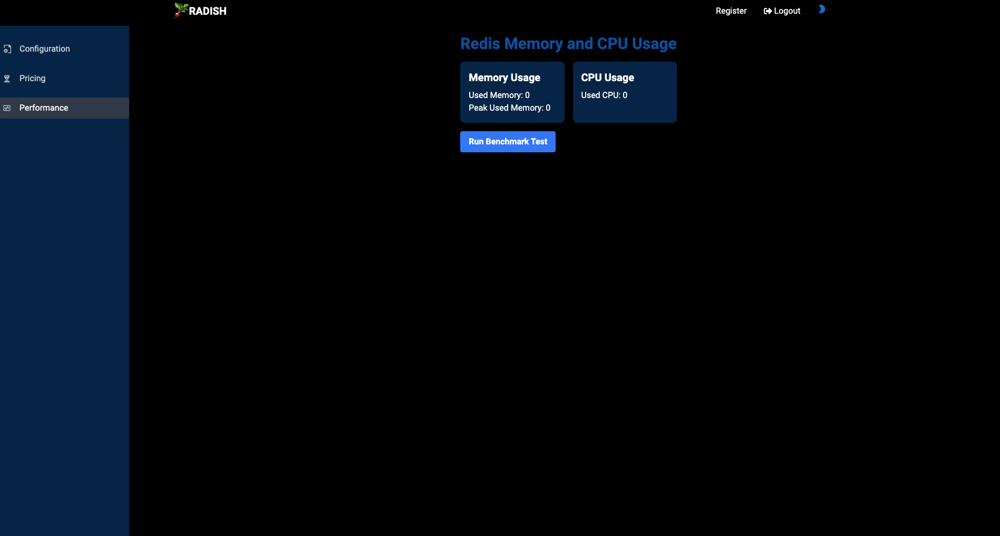

# <p align="center">🚀Welcome to Radish!🚀</p>

<p align="center"></p>

<p align="center">
    <a href="https://hdynkuaw7j.us-east-2.awsapprunner.com/">Website</a> | 
    <a href="https://medium.com/@charlizezhou_2295/introducing-radish-dbe20b276d7d">Medium</a> |
    <a href="https://www.linkedin.com/company/radishdev/">LinkedIn</a>
</p>

<p align="center">
  <a href="https://skillicons.dev">
    
  </a>
</p>
Radish an open-source application designed to simplify Redis cluster management. This is your one-stop shop for configuration, visualization, price estimation and performance monitoring. It integrates with Docker to ensure consistency across development, testing, and production environments. 

## <p align="center">Getting Started</p>

```bash
npm install
npm run dev
```

<p align="center"></p>

## <p align="center">Features</p>

### <p align="center">Easy Configuration</p>

Radish’s interface provides user-guided configuration steps with visualization of master-replica-shardings diagram. You can choose default setting, or create AOF(Append-Only File) and RDB(Redis Database Backup) persistence to manage the balance of data durability and performance. Redis config files would be generated after setting for you to test it locally or in AWS console.

<p align="center"></p>

### <p align="center">Pricing Estimation</p>

Managing costs is critical. Radish includes a price estimation feature that helps developers understand the financial implications of their Redis cluster setups. By providing clear cost estimates, Radish enables better budgeting and resource allocation.

<p align="center"></p>

### <p align="center">Now, Ready to Build!</p>

<p align="center"></p>

### <p align="center">Performance Benchmark</p>

Understanding the performance of your Redis instances is essential for maintaining high availability and responsiveness. Radish offers real-time insights into your Redis clusters. This includes latency, throughput, CPU utilization and memory usage, helping you optimize performance and identify potential bottlenecks.

<p align="center"></p>

## <p align="center">Future Features in Roadmap</p>
We’re just getting started! Future plans for Radish include more granular visualizations and support for new genAI (Redis Vector Library) features.

## <p align="center">Start to Contribute</p>

Add .env file, something like below:

```bash
AWS_ACCESS_KEY_ID=
AWS_SECRET_ACCESS_KEY=
MONGO_URI=
JWT_SECRET=
```


## Authors

| Name             | Connect with Us  | Check out our Work |
|------------------|-------------------|---------------------|
| Tom Djergian  | [LinkedIn](www.linkedin.com/in/thomas-djergian) | [GitHub](https://github.com/Tdjergian) |
| Jay Hoogheem   | [LinkedIn](https://www.linkedin.com/in/jay-hoogheem-26a468a/) | [GitHub](https://github.com/Jaysus119) |
| Charlize Zhou   | [LinkedIn](https://www.linkedin.com/in/charliezdev/) | [GitHub](https://github.com/charliezhou1) |
| Ksenia Vasileva  | [LinkedIn](https://www.linkedin.com/in/ksenia-vasileva/) | [GitHub](https://github.com/basswoman) |
| Sameer Syed  | [LinkedIn](https://www.linkedin.com/in/sameer-syed-44370624a/) | [GitHub](https://github.com/SameerSyed99) |
